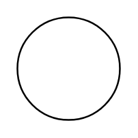

# Electrical Motor

## Definition

```
{
  _style: 'verticalLabelPosition=middle;shadow=0;dashed=0;align=center;html=1;verticalAlign=middle;strokeWidth=1;shape=ellipse;aspect=fixed;fontSize=35;',
  _width: 60,
  _height: 60,
}
```

## Usage

```
import { ElectricalMotor } from '@reactiac/standard-components-diagrams/electricalMisc'

<ElectricalMotor/>
```

## Preview


