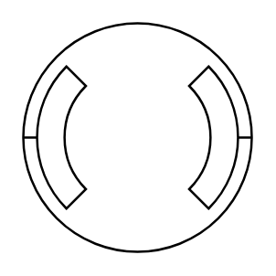

# F/M 2 Conductor 2

## Definition

```
{
  _style: { 
    entity: 'pointerEvents=1;verticalLabelPosition=bottom;shadow=0;dashed=0;align=center;html=1;verticalAlign=top;shape=mxgraph.electrical.miscellaneous.f_m_2_conductor_2',
  },
  _original_width: 100,
  _original_height: 100,
}
```

## Usage

```
import { FM2Conductor2 } from '@dinghy/standard-components-diagrams/electricalMisc'

<FM2Conductor2/>
```

## Preview


