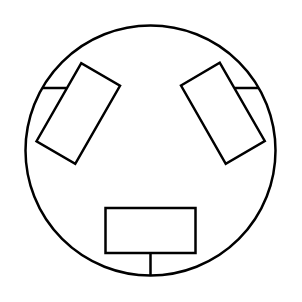

# F/M 3 Conductor 5

## Definition

```
{
  _style: 'pointerEvents=1;verticalLabelPosition=bottom;shadow=0;dashed=0;align=center;html=1;verticalAlign=top;shape=mxgraph.electrical.miscellaneous.f_m_3_conductor_5',
  _width: 100,
  _height: 100,
}
```

## Usage

```
import { FM3Conductor5 } from '@reactiac/standard-components-diagrams/electricalMisc'

<FM3Conductor5/>
```

## Preview


