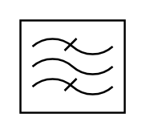

# Filter

## Definition

```
{
  _style: 'verticalLabelPosition=bottom;shadow=0;dashed=0;align=center;html=1;verticalAlign=top;shape=mxgraph.electrical.abstract.filter;',
  _width: 52,
  _height: 46,
}
```

## Usage

```
import { Filter } from '@reactiac/standard-components-diagrams/electricalMisc'

<Filter/>
```

## Preview


