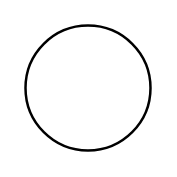

# Function

## Definition

```
{
  _style: { 
    entity: 'shape=mxgraph.electrical.abstract.function;html=1;shadow=0;dashed=0;align=center;strokeWidth=1;fontSize=24',
  },
  _original_width: 50,
  _original_height: 50,
}
```

## Usage

```
import { Function } from '@dinghy/standard-components-diagrams/electricalMisc'

<Function/>
```

## Preview


