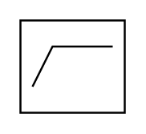

# Highpass Filter

## Definition

```
{
  _style: { 
    entity: 'verticalLabelPosition=bottom;shadow=0;dashed=0;align=center;html=1;verticalAlign=top;shape=mxgraph.electrical.logic_gates.highpass_filter;',
  },
  _original_width: 52,
  _original_height: 46,
}
```

## Usage

```
import { HighpassFilter } from '@dinghy/standard-components-diagrams/electricalMisc'

<HighpassFilter/>
```

## Preview


