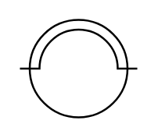

# Illuminating Bulb

## Definition

```
{
  _style: { 
    entity: 'pointerEvents=1;verticalLabelPosition=bottom;shadow=0;dashed=0;align=center;html=1;verticalAlign=top;shape=mxgraph.electrical.miscellaneous.illuminating_bulb;',
  },
  _width: 60,
  _height: 50,
}
```

## Usage

```
import { IlluminatingBulb } from '@diac/standard-components-diagrams/electricalMisc'

<IlluminatingBulb/>
```

## Preview


