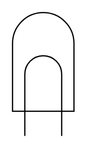

# Lamp

## Definition

```
{
  _style: { 
    entity: 'verticalLabelPosition=bottom;shadow=0;dashed=0;align=center;html=1;verticalAlign=top;shape=mxgraph.electrical.opto_electronics.lamp',
  },
  _original_width: 50,
  _original_height: 100,
}
```

## Usage

```
import { Lamp } from '@diac/standard-components-diagrams/electricalMisc'

<Lamp/>
```

## Preview


