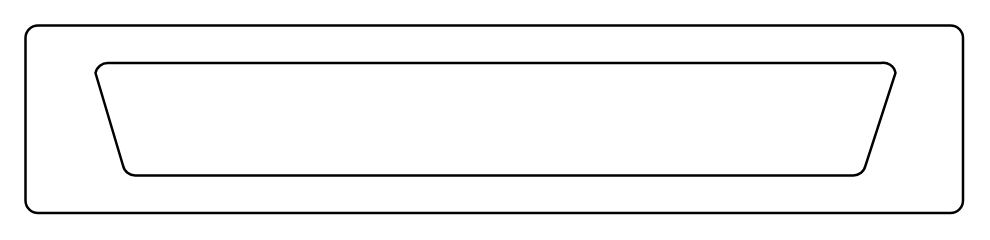

# Large D Connector

## Definition

```
{
  _style: { 
    entity: 'pointerEvents=1;verticalLabelPosition=bottom;shadow=0;dashed=0;align=center;html=1;verticalAlign=top;shape=mxgraph.electrical.miscellaneous.large_d_connector',
  },
  _width: 375,
  _height: 75,
}
```

## Usage

```
import { LargeDConnector } from '@diac/standard-components-diagrams/electricalMisc'

<LargeDConnector/>
```

## Preview


