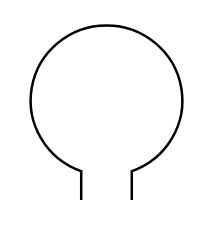

# Loop Antenna

## Definition

```
{
  _style: 'verticalLabelPosition=bottom;shadow=0;dashed=0;align=center;html=1;verticalAlign=top;shape=mxgraph.electrical.radio.loop_antenna;',
  _width: 64.8,
  _height: 69.78,
}
```

## Usage

```
import { LoopAntenna } from '@reactiac/standard-components-diagrams/electricalMisc'

<LoopAntenna/>
```

## Preview


