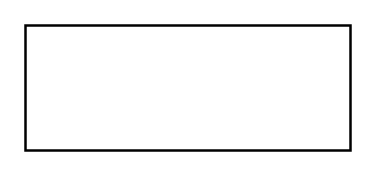

# Material

## Definition

```
{
  _style: 'verticalLabelPosition=bottom;shadow=0;dashed=0;align=center;html=1;verticalAlign=top;strokeWidth=1;shape=rect;',
  _width: 130,
  _height: 50,
}
```

## Usage

```
import { Material } from '@reactiac/standard-components-diagrams/electricalMisc'

<Material/>
```

## Preview


