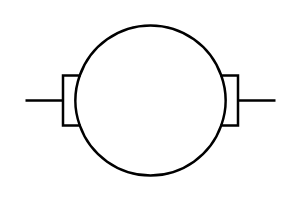

# Motor Armature

## Definition

```
{
  _style: 'shape=mxgraph.electrical.electro-mechanical.motor_2;html=1;shadow=0;dashed=0;align=center;fontSize=30;strokeWidth=1;',
  _width: 100,
  _height: 60,
}
```

## Usage

```
import { MotorArmature } from '@reactiac/standard-components-diagrams/electricalMisc'

<MotorArmature/>
```

## Preview


