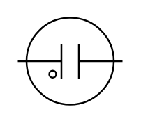

# Neon Lamp

## Definition

```
{
  _style: 'pointerEvents=1;verticalLabelPosition=bottom;shadow=0;dashed=0;align=center;html=1;verticalAlign=top;shape=mxgraph.electrical.miscellaneous.neon_lamp_2;',
  _width: 60,
  _height: 50,
}
```

## Usage

```
import { NeonLamp } from '@reactiac/standard-components-diagrams/electricalMisc'

<NeonLamp/>
```

## Preview


