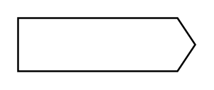

# Pickup Head

## Definition

```
{
  _style: { 
    entity: 'shape=mxgraph.arrows2.arrow;verticalLabelPosition=bottom;shadow=0;dashed=0;align=center;html=1;verticalAlign=top;strokeWidth=1;dy=0;dx=10;notch=0;',
  },
  _original_width: 100,
  _original_height: 30,
}
```

## Usage

```
import { PickupHead } from '@dinghy/standard-components-diagrams/electricalMisc'

<PickupHead/>
```

## Preview


