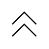

# Plug-Socket Connection

## Definition

```
{
  _style: 'pointerEvents=1;verticalLabelPosition=bottom;shadow=0;dashed=0;align=center;html=1;verticalAlign=top;shape=mxgraph.electrical.miscellaneous.plug_socket_connection',
  _width: 20,
  _height: 20,
}
```

## Usage

```
import { PlugSocketConnection } from '@reactiac/standard-components-diagrams/electricalMisc'

<PlugSocketConnection/>
```

## Preview


