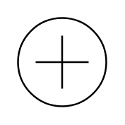

# Summation Point

## Definition

```
{
  _style: { 
    entity: 'verticalLabelPosition=bottom;shadow=0;dashed=0;align=center;html=1;verticalAlign=top;shape=mxgraph.electrical.abstract.summation_point;',
  },
  _width: 60,
  _height: 60,
}
```

## Usage

```
import { SummationPoint } from '@diac/standard-components-diagrams/electricalMisc'

<SummationPoint/>
```

## Preview


