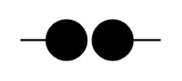

# Surge Protector

## Definition

```
{
  _style: 'verticalLabelPosition=bottom;shadow=0;dashed=0;align=center;fillColor=strokeColor;html=1;verticalAlign=top;strokeWidth=1;shape=mxgraph.electrical.miscellaneous.surge_protector;',
  _width: 70,
  _height: 20,
}
```

## Usage

```
import { SurgeProtector } from '@diac/standard-components-diagrams/electricalMisc'

<SurgeProtector/>
```

## Preview


