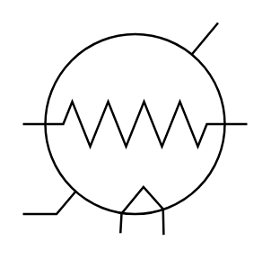

# Thermistor With Independent Integral Heater

## Definition

```
{
  _style: 'shape=mxgraph.electrical.abstract.thermistor_with_independent_integral_heater;html=1;shadow=0;dashed=0;strokeWidth=1;align=center;overflow=fill;fontSize=12;',
  _width: 100,
  _height: 94.25,
}
```

## Usage

```
import { ThermistorWithIndependentIntegralHeater } from '@reactiac/standard-components-diagrams/electricalMisc'

<ThermistorWithIndependentIntegralHeater/>
```

## Preview


