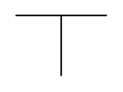

# Vdd

## Definition

```
{
  _style: { 
    entity: 'verticalLabelPosition=top;verticalAlign=bottom;shape=mxgraph.electrical.signal_sources.vdd;shadow=0;dashed=0;align=center;strokeWidth=1;fontSize=24;html=1;flipV=1;',
  },
  _original_width: 60,
  _original_height: 40,
}
```

## Usage

```
import { Vdd } from '@diac/standard-components-diagrams/electricalMisc'

<Vdd/>
```

## Preview


