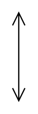

# Voltage

## Definition

```
{
  _style: { 
    entity: 'labelPosition=right;align=left;shape=mxgraph.electrical.signal_sources.voltage;shadow=0;dashed=0;strokeWidth=1;fontSize=10;html=1;',
  },
  _original_width: 10,
  _original_height: 70,
}
```

## Usage

```
import { Voltage } from '@diac/standard-components-diagrams/electricalMisc'

<Voltage/>
```

## Preview


