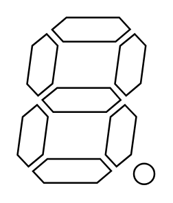

# 7 Segment Display with DP

## Definition

```
{
  _style: { 
    entity: 'verticalLabelPosition=bottom;shadow=0;dashed=0;align=center;html=1;verticalAlign=top;shape=mxgraph.electrical.opto_electronics.7_segment_display_with_dp;pointerEvents=1;',
  },
  _original_width: 79.8,
  _original_height: 96.9,
}
```

## Usage

```
import { Component7SegmentDisplayWithDp } from '@dinghy/standard-components-diagrams/electricalOptical'

<Component7SegmentDisplayWithDp/>
```

## Preview


