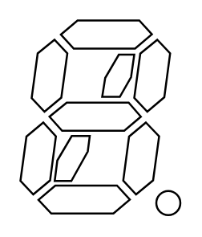

# 9 Segment Display with DP

## Definition

```
{
  _style: 'verticalLabelPosition=bottom;shadow=0;dashed=0;align=center;html=1;verticalAlign=top;shape=mxgraph.electrical.opto_electronics.9_segment_display_with_dp;pointerEvents=1;',
  _width: 79.8,
  _height: 96.9,
}
```

## Usage

```
import { Component9SegmentDisplayWithDp } from '@reactiac/standard-components-diagrams/electricalOptical'

<Component9SegmentDisplayWithDp/>
```

## Preview


