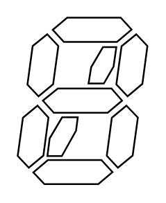

# 9 Segment Display

## Definition

```
{
  _style: { 
    entity: 'verticalLabelPosition=bottom;shadow=0;dashed=0;align=center;html=1;verticalAlign=top;shape=mxgraph.electrical.opto_electronics.9_segment_display;pointerEvents=1;',
  },
  _original_width: 74.7,
  _original_height: 96.1,
}
```

## Usage

```
import { Component9SegmentDisplay } from '@dinghy/standard-components-diagrams/electricalOptical'

<Component9SegmentDisplay/>
```

## Preview


