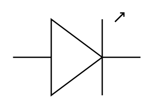

# LED

## Definition

```
{
  _style: { 
    entity: 'verticalLabelPosition=bottom;shadow=0;dashed=0;align=center;html=1;verticalAlign=top;shape=mxgraph.electrical.opto_electronics.led_1;pointerEvents=1;',
  },
  _width: 100,
  _height: 65,
}
```

## Usage

```
import { Led } from '@diac/standard-components-diagrams/electricalOptical'

<Led/>
```

## Preview


