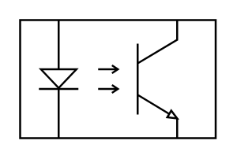

# Opto-coupler

## Definition

```
{
  _style: 'verticalLabelPosition=bottom;shadow=0;dashed=0;align=center;html=1;verticalAlign=top;shape=mxgraph.electrical.opto_electronics.opto-coupler;',
  _width: 99,
  _height: 60,
}
```

## Usage

```
import { OptoCoupler } from '@reactiac/standard-components-diagrams/electricalOptical'

<OptoCoupler/>
```

## Preview


