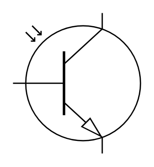

# Opto-transistor

## Definition

```
{
  _style: 'verticalLabelPosition=bottom;shadow=0;dashed=0;align=center;html=1;verticalAlign=top;shape=mxgraph.electrical.opto_electronics.opto-transistor;',
  _width: 100,
  _height: 110,
}
```

## Usage

```
import { OptoTransistor } from '@reactiac/standard-components-diagrams/electricalOptical'

<OptoTransistor/>
```

## Preview


