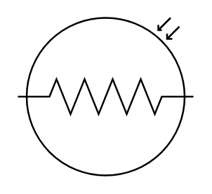

# Photo Resistor 3

## Definition

```
{
  _style: 'verticalLabelPosition=bottom;shadow=0;dashed=0;align=center;html=1;verticalAlign=top;shape=mxgraph.electrical.opto_electronics.photo_resistor_3;',
  _width: 100,
  _height: 90,
}
```

## Usage

```
import { PhotoResistor3 } from '@diac/standard-components-diagrams/electricalOptical'

<PhotoResistor3/>
```

## Preview


