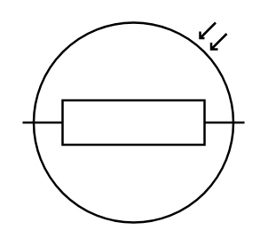

# Photo Resistor

## Definition

```
{
  _style: 'verticalLabelPosition=bottom;shadow=0;dashed=0;align=center;html=1;verticalAlign=top;shape=mxgraph.electrical.opto_electronics.photo_resistor_1;',
  _width: 100,
  _height: 90,
}
```

## Usage

```
import { PhotoResistor } from '@reactiac/standard-components-diagrams/electricalOptical'

<PhotoResistor/>
```

## Preview


