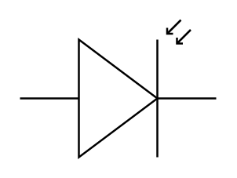

# Photodiode

## Definition

```
{
  _style: 'verticalLabelPosition=bottom;shadow=0;dashed=0;align=center;html=1;verticalAlign=top;shape=mxgraph.electrical.opto_electronics.photodiode;pointerEvents=1;',
  _width: 100,
  _height: 70,
}
```

## Usage

```
import { Photodiode } from '@reactiac/standard-components-diagrams/electricalOptical'

<Photodiode/>
```

## Preview


