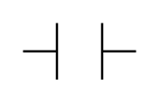

# Contact

## Definition

```
{
  _style: { 
    entity: 'pointerEvents=1;verticalLabelPosition=bottom;shadow=0;dashed=0;align=center;html=1;verticalAlign=top;shape=mxgraph.electrical.plc_ladder.contact;',
  },
  _original_width: 50,
  _original_height: 25,
}
```

## Usage

```
import { Contact } from '@diac/standard-components-diagrams/electricalPlcLadder'

<Contact/>
```

## Preview


