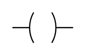

# Electrical PLC Ladder Entities

- [Contact](./contact.md)  

- [ContactN](./contact-n.md)  

- [Output](./output.md)  

- [OutputN](./output-n.md)  

- [OutputN2](./output-n-2.md)  

- [Output2](./output-2.md)  

