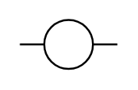

# Output 2

## Definition

```
{
  _style: 'pointerEvents=1;verticalLabelPosition=bottom;shadow=0;dashed=0;align=center;html=1;verticalAlign=top;shape=mxgraph.electrical.plc_ladder.output_2;',
  _width: 50,
  _height: 25,
}
```

## Usage

```
import { Output2 } from '@diac/standard-components-diagrams/electricalPlcLadder'

<Output2/>
```

## Preview


