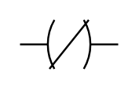

# Output (N)

## Definition

```
{
  _style: 'pointerEvents=1;verticalLabelPosition=bottom;shadow=0;dashed=0;align=center;html=1;verticalAlign=top;shape=mxgraph.electrical.plc_ladder.not_output_1;',
  _width: 50,
  _height: 25,
}
```

## Usage

```
import { OutputN } from '@reactiac/standard-components-diagrams/electricalPlcLadder'

<OutputN/>
```

## Preview


