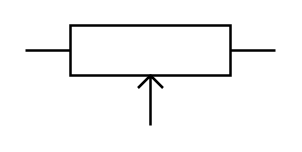

# Potentiometer

## Definition

```
{
  _style: 'pointerEvents=1;verticalLabelPosition=bottom;shadow=0;dashed=0;align=center;html=1;verticalAlign=top;shape=mxgraph.electrical.resistors.potentiometer_1;',
  _width: 100,
  _height: 40,
}
```

## Usage

```
import { Potentiometer } from '@reactiac/standard-components-diagrams/electricalResistors'

<Potentiometer/>
```

## Preview


