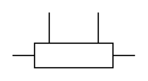

# Resistor (Shunt)

## Definition

```
{
  _style: { 
    entity: 'pointerEvents=1;verticalLabelPosition=bottom;shadow=0;dashed=0;align=center;html=1;verticalAlign=top;shape=mxgraph.electrical.resistors.resistor,_shunt;',
  },
  _original_width: 100,
  _original_height: 45,
}
```

## Usage

```
import { ResistorShunt } from '@diac/standard-components-diagrams/electricalResistors'

<ResistorShunt/>
```

## Preview


