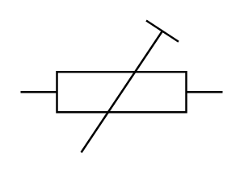

# Resistor (Trimmer)

## Definition

```
{
  _style: 'pointerEvents=1;verticalLabelPosition=bottom;shadow=0;dashed=0;align=center;html=1;verticalAlign=top;shape=mxgraph.electrical.resistors.trimmer_resistor_1;',
  _width: 100,
  _height: 65.5,
}
```

## Usage

```
import { ResistorTrimmer } from '@diac/standard-components-diagrams/electricalResistors'

<ResistorTrimmer/>
```

## Preview


