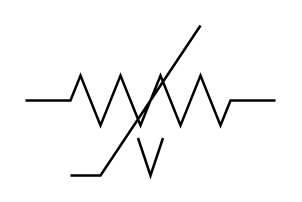

# Varistor (Symmetrical)

## Definition

```
{
  _style: 'pointerEvents=1;verticalLabelPosition=bottom;shadow=0;dashed=0;align=center;html=1;verticalAlign=top;shape=mxgraph.electrical.resistors.symmetrical_varistor;',
  _width: 100,
  _height: 60,
}
```

## Usage

```
import { VaristorSymmetrical } from '@reactiac/standard-components-diagrams/electricalResistors'

<VaristorSymmetrical/>
```

## Preview


