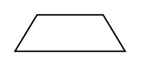

# Brake

## Definition

```
{
  _style: 'verticalLabelPosition=bottom;shadow=0;dashed=0;align=center;html=1;verticalAlign=top;strokeWidth=1;shape=trapezoid;perimeter=none;',
  _width: 75,
  _height: 25,
}
```

## Usage

```
import { Brake } from '@diac/standard-components-diagrams/electricalRotatingEquipmentMechanicalFunctions'

<Brake/>
```

## Preview


