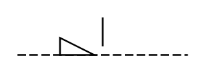

# Latching Device

## Definition

```
{
  _style: { 
    entity: 'verticalLabelPosition=bottom;shadow=0;dashed=0;align=center;html=1;verticalAlign=top;shape=mxgraph.electrical.rot_mech.latching_device;pointerEvents=1;',
  },
  _original_width: 100,
  _original_height: 22,
}
```

## Usage

```
import { LatchingDevice } from '@dinghy/standard-components-diagrams/electricalRotatingEquipmentMechanicalFunctions'

<LatchingDevice/>
```

## Preview


