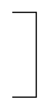

# Permanent Magnet

## Definition

```
{
  _style: 'pointerEvents=1;verticalLabelPosition=bottom;shadow=0;dashed=0;align=center;html=1;verticalAlign=top;shape=mxgraph.electrical.miscellaneous.permanent_magnet;pointerEvents=1;',
  _width: 20,
  _height: 70,
}
```

## Usage

```
import { PermanentMagnet } from '@diac/standard-components-diagrams/electricalRotatingEquipmentMechanicalFunctions'

<PermanentMagnet/>
```

## Preview


