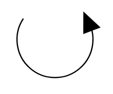

# Rotation

## Definition

```
{
  _style: 'verticalLabelPosition=bottom;shadow=0;dashed=0;align=center;html=1;verticalAlign=top;shape=mxgraph.electrical.rot_mech.verticalLabelPosition=bottom;shadow=0;dashed=0;align=center;fillColor=strokeColor;html=1;verticalAlign=top;strokeWidth=1;shape=mxgraph.electrical.rot_mech.rotation;',
  _width: 69,
  _height: 54,
}
```

## Usage

```
import { Rotation } from '@diac/standard-components-diagrams/electricalRotatingEquipmentMechanicalFunctions'

<Rotation/>
```

## Preview


