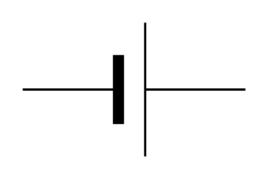

# Accumulator / Monocell Battery

## Definition

```
{
  _style: { 
    entity: 'verticalLabelPosition=bottom;shadow=0;dashed=0;align=center;fillColor=strokeColor;html=1;verticalAlign=top;strokeWidth=1;shape=mxgraph.electrical.miscellaneous.monocell_battery;',
  },
  _original_width: 100,
  _original_height: 60,
}
```

## Usage

```
import { AccumulatorMonocellBattery } from '@dinghy/standard-components-diagrams/electricalSources'

<AccumulatorMonocellBattery/>
```

## Preview


