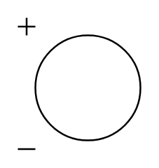

# DC

## Definition

```
{
  _style: 'pointerEvents=1;verticalLabelPosition=bottom;shadow=0;dashed=0;align=center;html=1;verticalAlign=top;shape=mxgraph.electrical.signal_sources.dc_source_1;',
  _width: 70,
  _height: 75,
}
```

## Usage

```
import { Dc } from '@reactiac/standard-components-diagrams/electricalSources'

<Dc/>
```

## Preview


