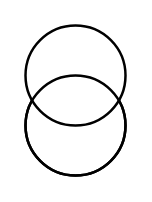
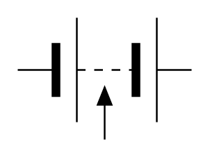
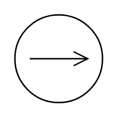
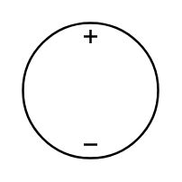
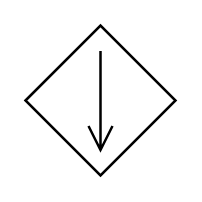
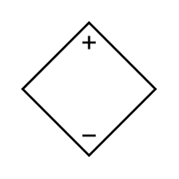
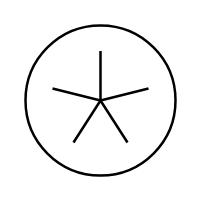
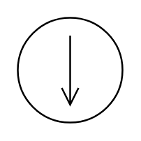
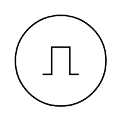
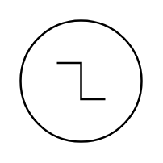

# Electrical Sources Entities

- [AccumulatorMonocellBattery](./accumulator-monocell-battery.md)  

- [BatteryStack](./battery-stack.md)  

- [Current](./current.md)  

- [Dc](./dc.md)  

- [MulticellBatteryTapped](./multicell-battery-tapped.md)  

- [Source](./source.md)  

- [Source2](./source-2.md)  

- [Source3](./source-3.md)  

- [Source4](./source-4.md)  

- [Source5](./source-5.md)  

- [Source6](./source-6.md)  

- [Source7](./source-7.md)  

- [Source8](./source-8.md)  

- [Source9](./source-9.md)  

- [SourceChoppedSquare](./source-chopped-square.md)  

- [SourceDc](./source-dc.md)  

- [SourceInversePulse](./source-inverse-pulse.md)  

- [SourcePulse](./source-pulse.md)  

- [SourceSawtooth](./source-sawtooth.md)  

- [SourceSquare](./source-square.md)  

- [SourceStepOff](./source-step-off.md)  

- [SourceStepOn](./source-step-on.md)  

- [SourceTriangular](./source-triangular.md)  

