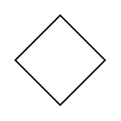

# Source 4

## Definition

```
{
  _style: 'pointerEvents=1;verticalLabelPosition=bottom;shadow=0;dashed=0;align=center;html=1;verticalAlign=top;shape=mxgraph.electrical.signal_sources.source;aspect=fixed;points=[[0.5,0,0],[1,0.5,0],[0.5,1,0],[0,0.5,0]];elSignalType=none;elSourceType=dependent;',
  _width: 60,
  _height: 60,
}
```

## Usage

```
import { Source4 } from '@reactiac/standard-components-diagrams/electricalSources'

<Source4/>
```

## Preview


