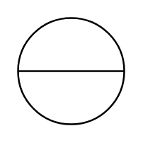

# Source 8

## Definition

```
{
  _style: { 
    entity: 'pointerEvents=1;verticalLabelPosition=bottom;shadow=0;dashed=0;align=center;html=1;verticalAlign=top;shape=mxgraph.electrical.signal_sources.source;aspect=fixed;points=[[0.5,0,0],[1,0.5,0],[0.5,1,0],[0,0.5,0]];elSignalType=ideal;',
  },
  _width: 60,
  _height: 60,
}
```

## Usage

```
import { Source8 } from '@diac/standard-components-diagrams/electricalSources'

<Source8/>
```

## Preview


