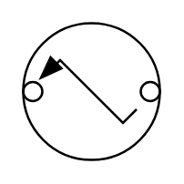

# Source 9

## Definition

```
{
  _style: { 
    entity: 'pointerEvents=1;verticalLabelPosition=bottom;shadow=0;dashed=0;align=center;html=1;verticalAlign=top;shape=mxgraph.electrical.signal_sources.source;aspect=fixed;points=[[0.5,0,0],[1,0.5,0],[0.5,1,0],[0,0.5,0]];elSignalType=expSquib;',
  },
  _original_width: 60,
  _original_height: 60,
}
```

## Usage

```
import { Source9 } from '@dinghy/standard-components-diagrams/electricalSources'

<Source9/>
```

## Preview


