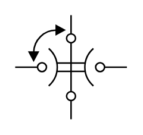

# 4-Position Switch 3

## Definition

```
{
  _style: 'pointerEvents=1;verticalLabelPosition=bottom;shadow=0;dashed=0;align=center;html=1;verticalAlign=top;shape=mxgraph.electrical.electro-mechanical.fourPositionSwitch2;elSwitchState=3;',
  _width: 75,
  _height: 70,
}
```

## Usage

```
import { Component4PositionSwitch3 } from '@reactiac/standard-components-diagrams/electricalSwitchesAndRelays'

<Component4PositionSwitch3/>
```

## Preview


