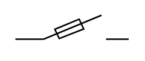

# Fuse Off

## Definition

```
{
  _style: 'html=1;shape=mxgraph.electrical.electro-mechanical.fuse2;aspect=fixed;elSwitchState=off;',
  _width: 75,
  _height: 20,
}
```

## Usage

```
import { FuseOff } from '@reactiac/standard-components-diagrams/electricalSwitchesAndRelays'

<FuseOff/>
```

## Preview


