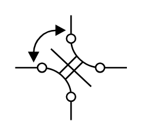
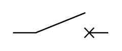
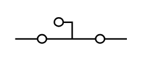
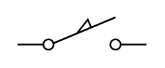
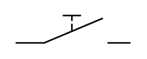
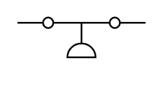
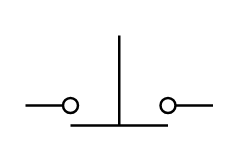
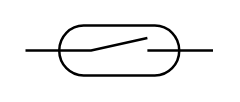
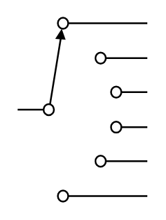
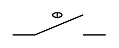

# Electrical Switches and Relays Entities

- [Component2PositionSwitch](./component-2-position-switch.md)  

- [Component2PositionSwitch2](./component-2-position-switch-2.md)  

- [Component3PositionSwitch](./component-3-position-switch.md)  

- [Component3PositionSwitch2](./component-3-position-switch-2.md)  

- [Component3PositionSwitch3](./component-3-position-switch-3.md)  

- [Component4PositionSwitch](./component-4-position-switch.md)  

- [Component4PositionSwitch2](./component-4-position-switch-2.md)  

- [Component4PositionSwitch3](./component-4-position-switch-3.md)  

- [Component4PositionSwitch4](./component-4-position-switch-4.md)  

- [BreakContact](./break-contact.md)  

- [ChangeoverContact](./changeover-contact.md)  

- [ChangeoverContact2](./changeover-contact-2.md)  

- [CircuitBreakerOff](./circuit-breaker-off.md)  

- [CircuitBreakerOn](./circuit-breaker-on.md)  

- [Dpdt](./dpdt.md)  

- [Dpdt2](./dpdt-2.md)  

- [DpstOff](./dpst-off.md)  

- [DpstOn](./dpst-on.md)  

- [FlowActuatedOff](./flow-actuated-off.md)  

- [FlowActuatedOn](./flow-actuated-on.md)  

- [FuseOff](./fuse-off.md)  

- [FuseOn](./fuse-on.md)  

- [GasFlowActuatedOff](./gas-flow-actuated-off.md)  

- [GasFlowActuatedOn](./gas-flow-actuated-on.md)  

- [InertiaSwitchOff](./inertia-switch-off.md)  

- [InertiaSwitchOn](./inertia-switch-on.md)  

- [IsolatorOff](./isolator-off.md)  

- [IsolatorOn](./isolator-on.md)  

- [LimitSwitchNc](./limit-switch-nc.md)  

- [LimitSwitchNo](./limit-switch-no.md)  

- [LimitSwitchOff](./limit-switch-off.md)  

- [LimitSwitchOn](./limit-switch-on.md)  

- [LiquidLevelActuatedOff](./liquid-level-actuated-off.md)  

- [LiquidLevelActuatedOff2](./liquid-level-actuated-off-2.md)  

- [LiquidLevelActuatedOn](./liquid-level-actuated-on.md)  

- [LiquidLevelActuatedOn2](./liquid-level-actuated-on-2.md)  

- [MakeContact](./make-contact.md)  

- [ManualSwitchOff](./manual-switch-off.md)  

- [ManualSwitchOn](./manual-switch-on.md)  

- [MercurySwitch](./mercury-switch.md)  

- [MercurySwitch2](./mercury-switch-2.md)  

- [PassingMakeContactOff](./passing-make-contact-off.md)  

- [PassingMakeContactOn](./passing-make-contact-on.md)  

- [PilotLight](./pilot-light.md)  

- [PressureActuatedOff](./pressure-actuated-off.md)  

- [PressureActuatedOn](./pressure-actuated-on.md)  

- [ProximityLimitSwitchOff](./proximity-limit-switch-off.md)  

- [ProximityLimitSwitchOn](./proximity-limit-switch-on.md)  

- [Pushbutton2Circuit](./pushbutton-2-circuit.md)  

- [Pushbutton2Circuit2](./pushbutton-2-circuit-2.md)  

- [PushbuttonBreakOff](./pushbutton-break-off.md)  

- [PushbuttonBreakOn](./pushbutton-break-on.md)  

- [PushbuttonMake](./pushbutton-make.md)  

- [PushbuttonMake2](./pushbutton-make-2.md)  

- [PushbuttonOff](./pushbutton-off.md)  

- [PushbuttonOn](./pushbutton-on.md)  

- [ReedSwitchOff](./reed-switch-off.md)  

- [ReedSwitchOn](./reed-switch-on.md)  

- [Relay](./relay.md)  

- [RelayCoil](./relay-coil.md)  

- [RelayCoil2](./relay-coil-2.md)  

- [RelayContacts](./relay-contacts.md)  

- [Resonator](./resonator.md)  

- [SafetyInterlockOff](./safety-interlock-off.md)  

- [SafetyInterlockOn](./safety-interlock-on.md)  

- [SelectorSwitch3Positions](./selector-switch-3-positions.md)  

- [SelectorSwitch4Positions](./selector-switch-4-positions.md)  

- [SelectorSwitch6Positions](./selector-switch-6-positions.md)  

- [ShortingSelector](./shorting-selector.md)  

- [SingleSwitchOff](./single-switch-off.md)  

- [SingleSwitchOn](./single-switch-on.md)  

- [Spdt](./spdt.md)  

- [SpringReturnOff](./spring-return-off.md)  

- [SpringReturnOn](./spring-return-on.md)  

- [StayPut](./stay-put.md)  

- [SwitchDisconnectorOff](./switch-disconnector-off.md)  

- [SwitchDisconnectorOn](./switch-disconnector-on.md)  

- [TemperatureActuatedOff](./temperature-actuated-off.md)  

- [TemperatureActuatedOn](./temperature-actuated-on.md)  

- [TemperatureSwitchOff](./temperature-switch-off.md)  

- [TemperatureSwitchOn](./temperature-switch-on.md)  

- [ThermostatOff](./thermostat-off.md)  

- [ThermostatOn](./thermostat-on.md)  

- [TimeDelayBreak](./time-delay-break.md)  

- [TimeDelayBreak2](./time-delay-break-2.md)  

- [TimeDelayMake](./time-delay-make.md)  

- [TimeDelayMake2](./time-delay-make-2.md)  

- [TwoWayContact](./two-way-contact.md)  

- [TwoWayContact2](./two-way-contact-2.md)  

- [TwoWayContactNeutral](./two-way-contact-neutral.md)  

